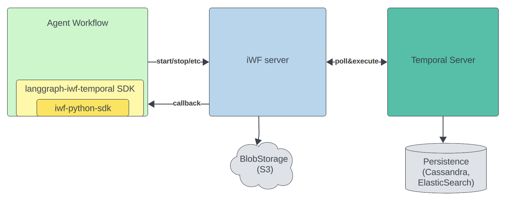

# LangGraph-iWF-Temporal (WIP)

A library on top of iWF/Temporal to define workflow in LangGraph's Graph APIs (node+edges).

## Overview

This library provides a bridge between LangGraph's intuitive graph-based workflow definition and the powerful execution capabilities of iWF/Temporal. It allows you to define workflows using LangGraph's node and edge paradigm while leveraging iWF/Temporal for highly scalable(1 millions+ actions per second), reliabley and low latency workflow execution.

## Architecture
The architecture of `langgraph-iwf-temporal` is designed to be lightweight and composable, sitting on top of the [iwf-python-sdk](https://github.com/indeedeng/iwf-python-sdk). 

At a high level:

- **Your application remains a standard iWF application**: You still write an iWF application, but you can now use the expressive [LangGraph](https://github.com/langchain-ai/langgraph) API to define your workflow as a graph of nodes and edges.
- **Graph-based Workflow Definition**: Using LangGraph's API, you define your workflow as a directed graph, where each node represents a step (state) and edges represent transitions.
- **Translation Layer**: This library translates the LangGraph graph into iWF states under the hood.
- **iWF Server Execution**: The iWF server interprets these states and executes them as a Temporal workflow, leveraging Temporal's scalability, reliability, and low-latency guarantees.

The result is that you get the best of both worlds: the intuitive, flexible graph-based workflow definition from LangGraph, and the robust, production-grade execution engine of iWF/Temporal.

### Architecture Diagram

Below is a high-level architecture diagram illustrating how the components fit together:



- **Application Code**: Uses LangGraph's graph API to define workflow logic.
- **langgraph-iwf-temporal**: Translates the graph into iWF states.
- **iwf-python-sdk**: Communicates with the iWF server.
- **iWF Server**: Interprets the workflow and executes it as a Temporal workflow.
- **Temporal Server**: Orchestrates workflow execution at scale.

This approach allows you to write expressive, maintainable workflow logic while relying on proven workflow orchestration infrastructure.


## Installation

Install the library using pip:

```bash
pip install langgraph-iwf-temporal
```

Or using Poetry:

```bash
poetry add langgraph-iwf-temporal
```

## Development

### Setting up Development Environment

1. Clone the repository
2. Install Poetry if you haven't already:
   ```bash
   curl -sSL https://install.python-poetry.org | python3 -
   ```
3. Install dependencies:
   ```bash
   poetry install
   ```

### Running Tests

```bash
poetry run pytest
```

### Code Formatting

```bash
poetry run black .
poetry run flake8 .
poetry run mypy .
```

### Building the Package

```bash
poetry build
```

### Publishing the Package

```bash
poetry publish
```

## Contributing

Contributions are welcome! Please feel free to submit a Pull Request.

## License

This project is licensed under the MIT License - see the LICENSE file for details.
